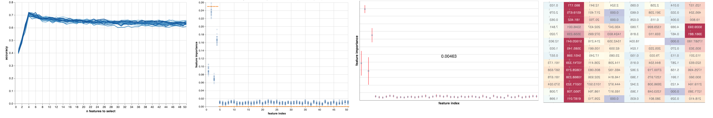

<p align="center">
  
</p>

# fseval

[](https://github.com/dunnkers/fseval/actions/workflows/python-app.yml) [](https://pypi.org/project/fseval/) [](https://github.com/psf/black) [](https://pepy.tech/project/fseval)  [](https://codecov.io/gh/dunnkers/fseval) [](https://lgtm.com/projects/g/dunnkers/fseval/context:python)

A Feature Ranker benchmarking pipeline. Useful for Feature Selection and Interpretable AI methods.

- 📊 **Online dashboard**. Experiments can be uploaded to [wandb](https://wandb.ai) for seamless experiment tracking and visualization. Feature importance and subset validation plots are built-in. 
- 🔄 **Scikit-Learn integration**. Integrates nicely with [sklearn](https://scikit-learn.org/). Any estimator that implements `fit` is supported.
- 🗄 **Dataset adapters**. Datasets can be loaded dynamically using an _adapter_. [OpenML](https://www.openml.org/search?type=data) support is built-in.
- 🎛 **Synthetic dataset generation**. Synthetic datasets can be generated and configured right in the library itself.
- 📌 **Relevant features ground-truth**. Datasets can have ground-truth relevant features defined, so the estimated versus the ground-truth feature importance is automatically plotted in the dashboard.
- ⚜️ **Subset validation**. Allows you to validate the quality of a feature ranking, by running a _validation_ estimator on some of the `k` best feature subsets.
- ⚖️ **Bootstrapping**. Allows you to approximate the _stability_ of an algorithm by running multiple experiments on bootstrap resampled datasets.
- ⚙️ **Reproducible configs**. Uses [Hydra](https://hydra.cc/) as a config parser, to allow configuring every part of the experiment. The config can be uploaded to wandb, so the experiment can be replayed later.

Any [sklearn](https://scikit-learn.org/) style estimator can be used as a Feature Ranker. Estimator must estimate at least one of:

1. **Feature importance**, using `feature_importances_`.
2. **Feature subset**, using `feature_support_`.
3. **Feature ranking**, using `feature_ranking_`.

## Install

```shell
pip install fseval
```

## Documentation

See the [documentation](https://fseval.github.io/) page.


## About
Built by at the University of Groningen.

---

<p align="center">2021 — <a href="https://dunnkers.com/">Jeroen Overschie</a></p>