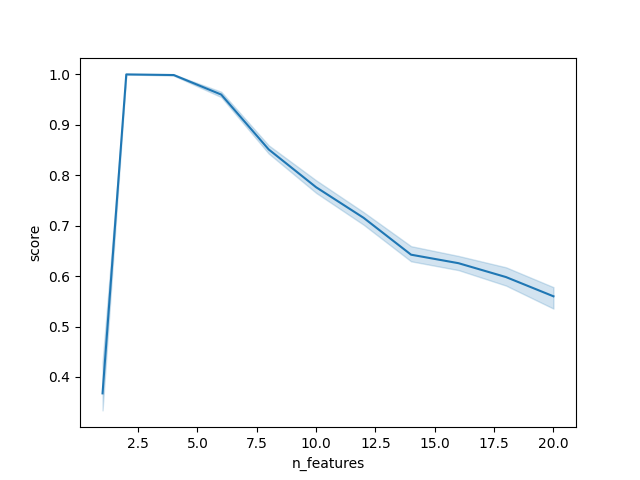
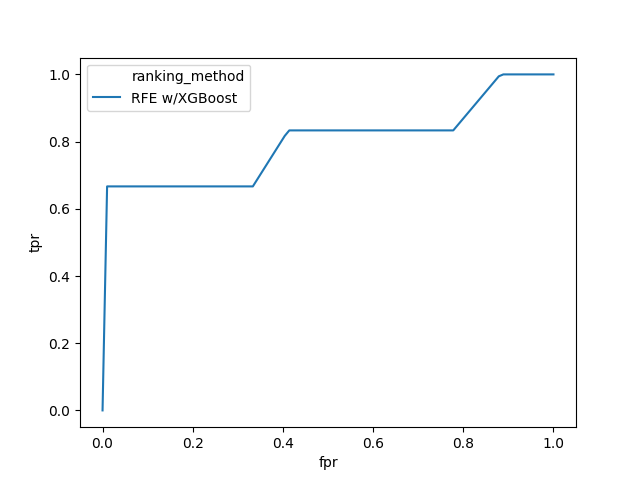
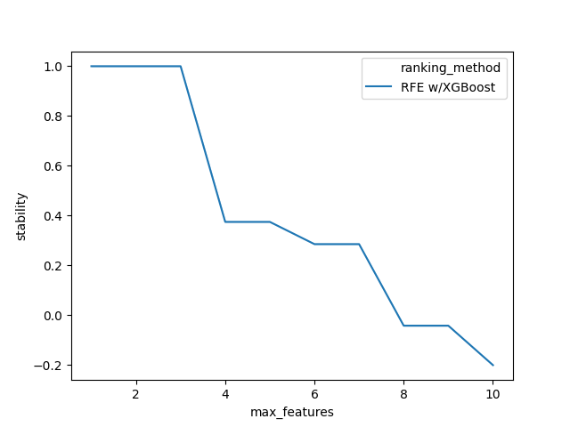

# fseval
Feature Selection evaluation framework 💎

## What
fseval is a framework for evaluating Feature Selection methods. By knowing _a priori_ what dataset features are informative, more meaningful evaluation can be performed. fseval provides metrics such as ROC- and PR curves, algorithm stability, and classification accuracy. The pipeline can be ran locally or on HPC systems (SLURM), scaling from a couple to testing thousands of benchmark datasets.

## Install

It's recommended to create a virtual environment to install dependencies:

```
python3 -m venv venv
source venv/bin/activate
```

Now install deps:
```shell
pip install  -r requirements.txt
```

Note that we require a Python **3** environment.

## Usage
Install locally (not on PyPi yet) by cloning the repo. To start feature ranking, execute in the root directory:

```shell
python -m fseval.ranking.rfe ./example/descriptor.csv --batch_id=test
```

Will run RFE feature selection on the datasets described in `./example/descriptor.csv`. This will produce a ranking results file in `./results/test`. Any custom feature selector can be used by using using code similar as in `fseval.ranking.rfe`, see code.

## Analysis
The results can be analyzed and validated as part of the pipeline.

### Validating classification accuracy
Validate with classification accuracy with k-NN:

```shell
python -m fseval.validation.knn ./example/descriptor.csv --batch_id=test
```

Which can now be plotted using seaborn/pandas using:
```python
import os
import pandas as pd
import seaborn as sns

valdata = []
for _, dataset in pd.read_csv('./example/descriptor.csv').iterrows():
    path = os.path.join('./results/test/validation', dataset.path + '.csv')
    data = pd.read_csv(path)
    valdata.append(data)
valdata = pd.concat(valdata)

sns.lineplot(data=valdata, x='n_features', y='score', hue='ranking_method')
```

Resulting in ✨:



### ROC and PR curve
Useful metrics can be computed as part of the evaluation pipeline. e.g. metrics for computing ROC or PR curves:

```shell
python -m fseval.analysis.roc ./example/descriptor.csv --batch_id=test
```

ROC curve:

```python
import os
import pandas as pd
import seaborn as sns
from fseval.analysis.lib.metrics import compute_interpolated_metrics
import matplotlib.pyplot as plt

rocdata = []
for _, dataset in pd.read_csv('./example/descriptor.csv').iterrows():
    path = os.path.join('./results/test/roc', dataset.path + '.csv')
    data = pd.read_csv(path)
    rocdata.append(data)
rocdata = pd.concat(rocdata)

metricdata = rocdata\
    .groupby(['description', 'ranking_method', 'replica_no'])\
    .apply(compute_interpolated_metrics)\
    .reset_index()
sns.lineplot(data=metricdata, x='fpr', y='tpr', hue='ranking_method')
plt.show()
sns.lineplot(data=metricdata, x='recall', y='precision', hue='ranking_method')
plt.show()
```

ROC:



Precision/Recall:


### Stability
Compute stability (Nogueira, 2018) using:

```shell
python -m fseval.analysis.binary_subsets ./example/descriptor.csv --batch_id=test
```

```python
import numpy as np
from fseval.analysis.lib import stability

bindata = []
for _, dataset in pd.read_csv('./example/descriptor.csv').iterrows():
    path = os.path.join('./results/test/binary_subsets', dataset.path + '.csv')
    data = pd.read_csv(path)
    bindata.append(data)
bindata = pd.concat(bindata)

def compute_stability(replicas):
    to_int = lambda array: list(map(int, array))
    Z = replicas.str.split(pat=',').map(to_int).values
    Z = np.array(Z.tolist()) # make numpy appreciate both dimensions properly.
    M, d = Z.shape
    if M == 1: # theres only 1 replica available. stability can't be computed.
        return { 'stability': np.nan, 'lower': np.nan, 'upper': np.nan }
    return stability.confidenceIntervals(Z)

def split_cols(row):
    return pd.Series({ 'stability': 
        [row.binary_subset['lower'],\
        row.binary_subset['stability'],\
        row.binary_subset['upper']]
    })

stabdata = bindata\
    .groupby(['description', 'ranking_method', 'max_features'])\
    .agg({ 'binary_subset': compute_stability })\
    .apply(split_cols, axis=1)\
    .explode('stability')\
    .reset_index()
stabdata['stability'] = pd.to_numeric(stabdata['stability'])

import matplotlib.pyplot as plt
sns.lineplot(data=stabdata, x='max_features', y='stability', hue='ranking_method')
```



## SLURM
`fseval` works built-in with SLURM clusters. When `fseval` is submitted in a job array, datasets are automatically distributed over a preconfigured amount of jobs and cpus.

... TODO: explain scripts

## About
By Jeroen Overschie | University of Groningen

Research Internship 2020, MSc Data Science and Systems Complexity.