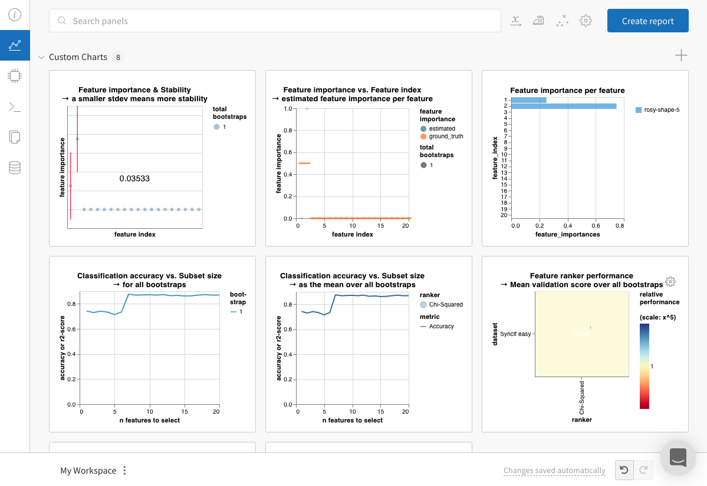
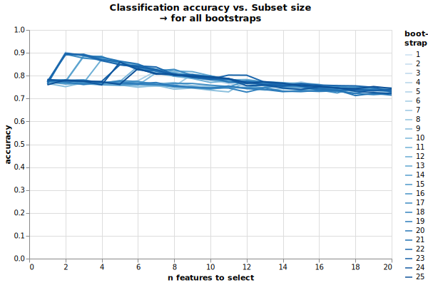

# fseval

[](https://github.com/dunnkers/fseval/actions/workflows/python-app.yml) [](https://pypi.org/project/fseval/)

A Feature Selector and Feature Ranker benchmarking library. Neatly integrates with [wandb](https://wandb.ai) and [sklearn](https://scikit-learn.org/). Uses [Hydra](https://hydra.cc/) as a config parser.

## Install

```shell
pip install fseval
```

## Usage
fseval is run via a CLI. As an example, this runs a very simple benchmark:
```shell
fseval +dataset=synclf_easy +estimator@ranker=chi2 +estimator@validator=decision_tree
```

Which runs Chi2 feature ranking on the 'Iris' dataset, and validates feature subsets using k-NN. The results can be uploaded to a backend. We can use **wandb** for this.


### Weights and Biases integration
Integration with [wandb](https://wandb.ai) is built-in. Create an account and login to the [CLI](https://github.com/wandb/client#-simple-integration-with-any-framework) with `wandb login`. Then, we can upload results like so:

```shell
fseval [...] callbacks="[wandb]" +callbacks.wandb.project=fseval-readme
```

Replace `[...]` with your dataset, ranker and validator config. This runs an experiment and uploads the results to wandb:
<p align="center">
  
</p>


We can now explore the results on the online dashboard:

<p align="center">
    <a href="https://wandb.ai/dunnkers/fseval-readme/runs/11b4t26e">
        
  </a>
</p>

✨


To see all the configurable options, run:
```shell
fseval --help
```

### Running bootstraps
_Bootstraps_ can be run, to approximate the stability of an algorithm. Bootstrapping works by creating multiple dataset permutations and running the algorithm on each of them. A simple way to create dataset permutations is to resample **with replacement**.

In fseval, bootstrapping can be configured like so:

```shell
fseval [...] resample=bootstrap n_bootstraps=8
```

To run the entire experiment 8 times, each for a resampled dataset. Ideally, when multiple processors are used, the number of bootstraps is set to an amount that is divisible by the amount of CPU's. For example:

```shell
fseval [...] resample=bootstrap n_bootstraps=8 n_jobs=4
```

would cause all 8 CPU's to be utilized efficiently. In the dashboard, plots are already set up to support bootstrapping. For example:
<p align="center">
  
</p>

Shows the validation results for **25** bootstraps. ✨

### Multiprocessing
The experiment can run in parallel. The list of bootstraps is distributed over the CPU's. To use all available processors:

```shell
fseval [...] n_jobs=-1
```

Alternatively, set `n_jobs` to the specific amount of processors to use. e.g. `n_jobs=4` if you have a quad-core.

### Distributed processing
Since fseval uses [Hydra](https://hydra.cc/), all Hydra plugins can also be used. Some of the plugins for distributed processing are:

- [RQ launcher](https://hydra.cc/docs/plugins/rq_launcher/). Uses [Redis Queue](https://python-rq.org/) (RQ) to launch jobs.
- [Submitit Launcher](https://hydra.cc/docs/plugins/submitit_launcher). Submits jobs directly to a [SLURM](https://slurm.schedmd.com/) cluster.

Example:
```shell
fseval --multirun [...] hydra/launcher=rq
```

To submit jobs to RQ.

### Configuring a Feature Ranker
The entirety of the config can be overriden like pleased. Like such, also feature rankers can be configured. For example:

```shell
fseval [...] +validator.classifier.estimator.criterion=entropy
```

Changes the Decision Tree criterion to entropy.

## Custom configuration
To further customize fseval, config can be loaded from a dir. It is configured like so:

```shell
fseval [...] --config-dir ./conf
```

With the `./conf` directory containing:

```shell
├── estimator
│   ├── my_custom_ranker.yaml
└── dataset
    ├── my_custom_dataset.yaml
```

Where `my_custom_ranker.yaml` would be any [estimator](https://github.com/dunnkers/fseval/tree/master/fseval/conf/estimator) definition, and `my_custom_dataset.yaml` any [dataset](https://github.com/dunnkers/fseval/tree/master/fseval/conf/dataset) dataset definition.


## Built-in Feature Rankers
A [collection](https://github.com/dunnkers/fseval/tree/master/fseval/conf/estimator) of feature rankers are already built-in, which can be used without further configuring. Others need their dependencies installed. List of rankers:

| Ranker | Dependency | Command line argument
--- | --- | ---
[ANOVA F-Value](https://scikit-learn.org/stable/modules/generated/sklearn.feature_selection.f_classif.html#sklearn.feature_selection.f_classif) | \<no dep\> | `+estimator@ranker=anova_f_value`
[Boruta](https://github.com/scikit-learn-contrib/boruta_py) | `pip install Boruta` | `+estimator@ranker=boruta`
[Chi2](https://scikit-learn.org/stable/modules/generated/sklearn.feature_selection.chi2.html) | \<no dep\> | `+estimator@ranker=chi2`
[Decision Tree](https://scikit-learn.org/stable/modules/generated/sklearn.tree.DecisionTreeClassifier.html) | \<no dep\> | `+estimator@ranker=decision_tree`
[FeatBoost](https://github.com/amjams/FeatBoost) | `pip install git+https://github.com/amjams/FeatBoost.git` | `+estimator@ranker=featboost`
[MultiSURF](https://github.com/EpistasisLab/scikit-rebate) | `pip install skrebate` | `+estimator@ranker=multisurf`
[Mutual Info](https://scikit-learn.org/stable/modules/generated/sklearn.feature_selection.mutual_info_classif.html) | \<no dep\> | `+estimator@ranker=mutual_info`
[ReliefF](https://github.com/EpistasisLab/scikit-rebate) | `pip install skrebate` | `+estimator@ranker=relieff`
[Stability Selection](https://github.com/scikit-learn-contrib/stability-selection) | `pip install git+https://github.com/dunnkers/stability-selection.git matplotlib` (ℹ️) | `+estimator@ranker=stability_selection`
[TabNet](https://github.com/dreamquark-ai/tabnet) | `pip install pytorch-tabnet` | `+estimator@ranker=tabnet`
[XGBoost](https://xgboost.readthedocs.io/) | `pip install xgboost` | `+estimator@ranker=xgb`
[Infinite Selection](https://github.com/giorgioroffo/Infinite-Feature-Selection) | `pip install git+https://github.com/dunnkers/infinite-selection.git` (ℹ️) | `+estimator@ranker=infinite_selection`


ℹ️ This library was customized to make it compatible with the fseval pipeline.

If you would like to install simply all dependencies, download the fseval [requirements.txt](https://github.com/dunnkers/fseval/blob/master/requirements.txt) file and run `pip install -r requirements.txt`.

### About
Built by [Jeroen Overschie](https://dunnkers.com/) as part of the Masters Thesis. Track: Data Science and Computational Complexity at the University of Groningen).